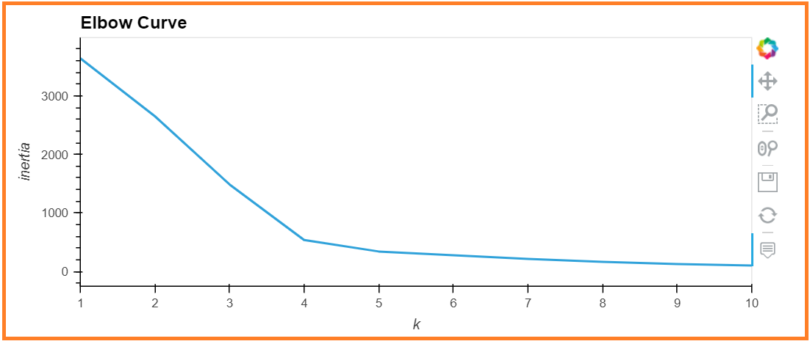

# Cryptocurrencies
Performed the following analysis using the crypto_data.csv dataset

- Part 1: Preprocessing the Data for PCA
- Part 2: Reducing Data Dimensions Using PCA
- Part 3: Clustering Cryptocurrencies Using K-means
- Part 4: Visualizing Cryptocurrencies Results

